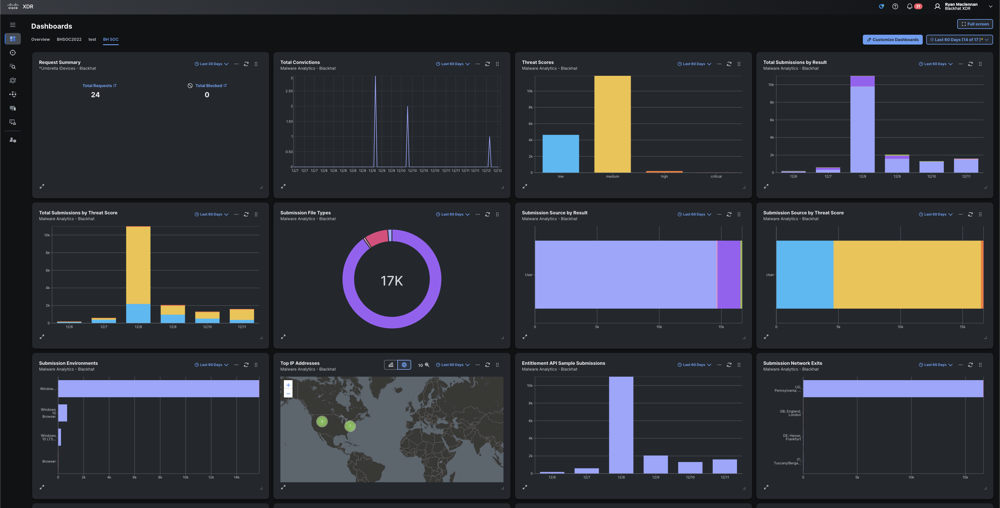

# XDR Development Introduction

In Cisco XDR, we are able to make integrations around dashboard tiles, enrichment (investigations), threat intelligence, incidents, assets, and automation.

We will do a quick overview of each so there is a base level of knowledge around each and what they are able to do.

## Dashboard Tiles

## Enrichment (Investigations)

## Threat Intelligence

## Incidents

## Assets

## Automation
