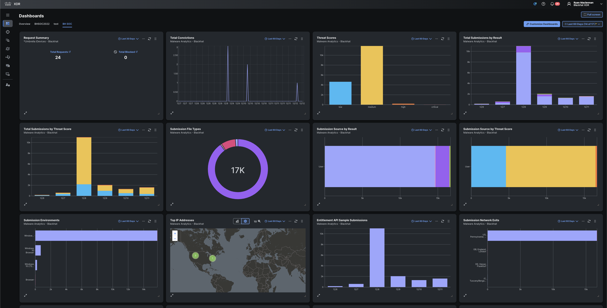

import Tabs from '@theme/Tabs';
import TabItem from '@theme/TabItem';

# XDR Development Introduction

In Cisco XDR, we are able to make integrations around dashboard tiles, enrichment (investigations), threat intelligence, incidents, assets, and automation.

We will do a quick overview of each so there is a base level of knowledge around each and what they are able to do.

## Incidents

### Overview

Incidents in XDR are the culmination of data from all the products integrated into XDR that provide data to the Data Analytics Platform (DAP). The DAP takes in data from these products, analyzes it for statistics, deviations, threat patterns, and more. Then the analysis is able to create an incident with supporting eveidence from the integrated products.

### Who Should Contribute

If your products can contribute telemetry or security detections, then an integration here would be a great value to your customers.

### Integration Types

<!-- 

Correlation

Incident correlation inntegrates directly into our Data Analytics Platform and can only be developed by Cisco. To make this integration with us, we would need your cooperation and readiness to provide technical assistance during the development process. However, injecting incidents into XDR does not require Cisco to develop an integraiton.

Injection

Injected incidents are incidents that are added to the XDR incidents queue via API. This bypasses the analytics you get get with the DAP but is a way to centralize incidents and create investigations from them.

 -->

<Tabs>
  <TabItem value="correlation" label="Correlation" default>
    Incident correlation integrates directly into our Data Analytics Platform and can only be developed by Cisco. To make this integration with us, we would need your cooperation and readiness to provide technical assistance during the development process. However, injecting incidents into XDR does not require Cisco to develop an integraiton.
  </TabItem>
  <TabItem value="injection" label="Injection">
    Injected incidents are incidents that are added to the XDR incidents queue via API. This bypasses the analytics you get get with the DAP but is a way to centralize incidents and create investigations from them.
  </TabItem>
</Tabs>

## Investigate (Enrichment)

### Overview

Investigations in XDR is how we combine threat intelligence, security detections, and response into a single command center. This data is combined and then shown to users to that they can be proactive and make better informed decisions when stopping threats and reducing [dwell time](https://www.connectwise.com).

Within an investigation, we correlate **observables** from the integrated products and then provide this information within the UI along with actions that can be taken on these observables (if there is an aciton that can be taken).

Observables can be identified system or network artifacts such as:

- IP addresses
- Domain names
- Files hashes
- User Names
- Processes
- Email addresses
- MAC Addresses
- User Agents
- Many More

### Who Should Contribute

If your product is able to provide at least of the below, then it is a good candidate to integrate with XDR.

- Reputational information or threat intelligence about an observable (Deliberation)
- Display information about an observable at a unique URL within your product's UI (Referral)
- Provide records (logs) about observables (Sightings)
- Provide response capabilities based on the type of observable (Response)

### Integration Types

<Tabs>
  <TabItem value="deliberation" label="Deliberation" default>
    Deliberating an observable in XDR inlcudes querying your product API about a specific observable and getting back a verdict.  The verdict can be uknown, suspicious, malicious, clean, and some others.
  </TabItem>
  <TabItem value="sightings" label="Sightings">
    Sightings are the logs from your product(s) that can be provided to XDR as additional information or indications within an XDR investigation.
  </TabItem>
    <TabItem value="referral" label="Referral">
    Referrals are useful to customers because it allows them to pivot out of the Cisco XDR and into your product's UI using a unique URL that your products provides. This is usually done as a way for customers to get additional information about an observable that we cannot display within XDR but your product does provide.
  </TabItem>
    <TabItem value="response" label="Response">
    Response actions are options you can provide to do "something" with an observable. This something can be to quarantine an observable, block it, or anything else your product is able to provide as an action on that observable.
  </TabItem>
</Tabs>

## Dashboard Tiles

## Threat Intelligence

## Assets

## Automation
