# Creating a Relay Module

To start off, we can create a relay module using one of Cisco XDR's relay templates for Python, NodeJs, or Go. If these are not desireable, the module can be made in any other language as long it is able to receive and respond to API requests.

For the rest of this guide, we will be using NodeJs as our preferred relay module programming language. We will be using VS Code as well for our IDE.

## Install dependencies

If using Python, NodeJs, or Go, please install the required software to make sure code will run on your operating system.

## Clone a Template

Open a terminal and run this command `git clone <repo_here>`

:::danger
Need to add the github repos here
:::

We now need to change into the directory of the template we just cloned. We should now be in the `node-express` directory. You may rename this to any other name you want, but this guide will use `node-express`. Now let us install all of the dependencies. Run `node i` in the terminal, that will install all the dependencies from the `package.json` file.

## Code Explanation

## Test the Relay Module Locally

Before we get to coding the entire module and then find out the basic functionality of actually running and responding doesn't work, we want to first run the relay module locally. To do this with Node, we need to be in the `node-express` directory and in our terminal run the command `node index.js`. Based on the template, it will start a server on port 5000.

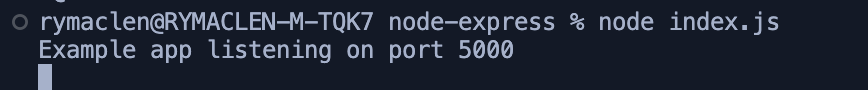

Now we can do a test to check if the health check is working for the relay module. In another terminal window or tab, run `curl localhost:5000/health`. This should return a status ok and that means we have a running web server that responds to requests. But we need to know if XDR will be able to query it as well.

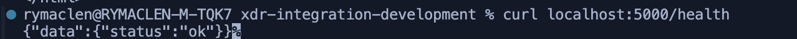

If you have the `jq` command installed, we can pipe the command into jq and get an easier to read version of the status. `curl localhost:5000/health | jq` This will be useful as we build the relay module.

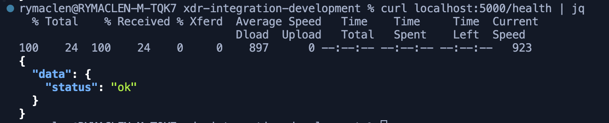

## Test the Module Locally (from XDR)

To test the module from our on-prem device (laptop, desktop or other internal development server), we will use ngrok to facilitate the connection between the local server and XDR.

:::note
if you do not want to use ngrok, I would recommend developing the relay in a cloud provider with a public IP on the VM, or by port forwarding to your development server. Please do not leave either of these options constantly running because of security risks.
:::

We must first get ngrok from this link: https://download.ngrok.com/

Then follow the instructions to get a ngrok auth token added to your profile. Then using the _Ephemeral Domain_ option, run the command listed but change the port to 5000. It should look similar to this command `ngrok http http://localhost:5000`.

It should return a status page in your terminal:
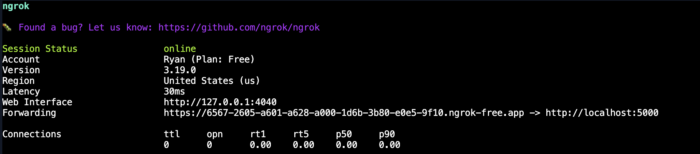

Copy the _Forwarding_ URL and store it somewhere easily accessible. Now, let us test that we can get to the relay module externally now.

Run `curl <forwarding url>/health | jq`
It should return the same status ok we got earlier when testing locally. This means we can get this working with XDR.
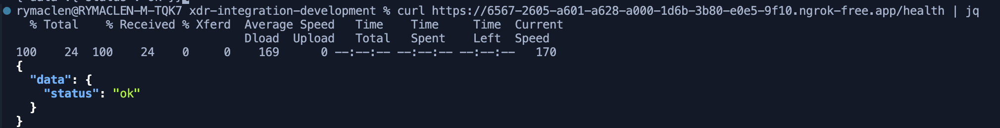

Since the ngrok tunnel is working, we need to log into XDR and go to the Integrations section. To do this, go to `Administration -> Integrations`.

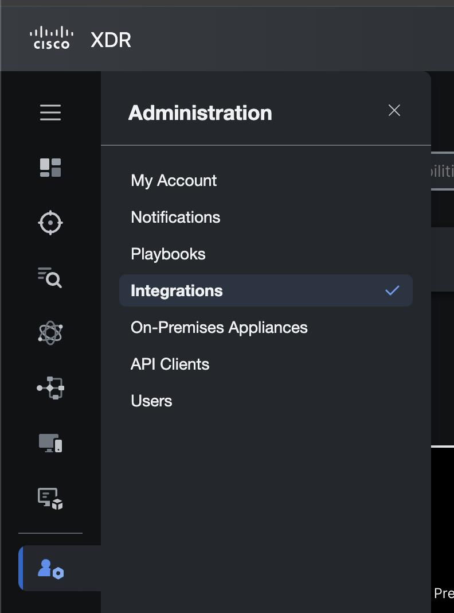

Then go to `Third Party Integrations`.

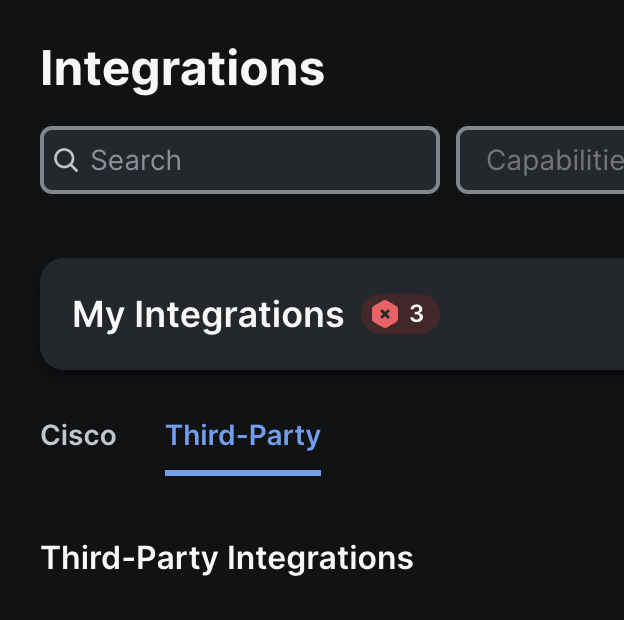

Once there, scroll down until you find the `Generic Serverless Relay`.

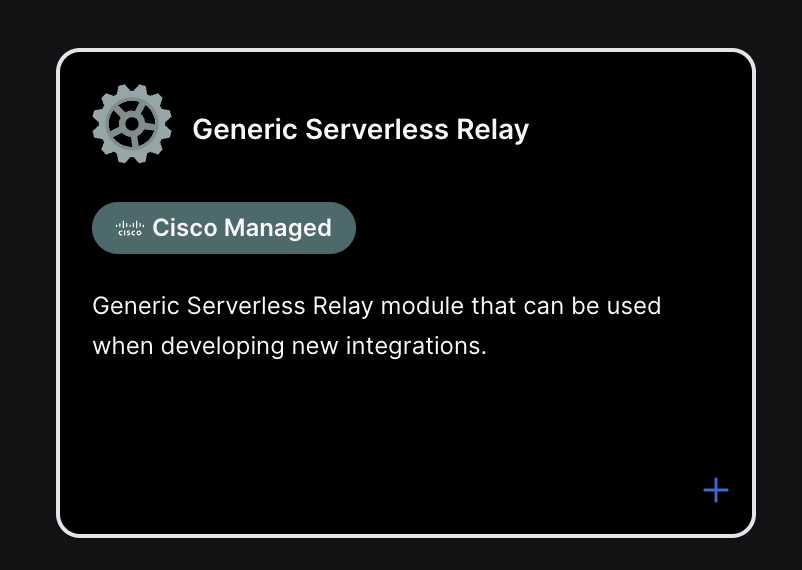

Click on the _+_ sign to add this to your XDR account.

It should bring up a new page where we can setup the relay.

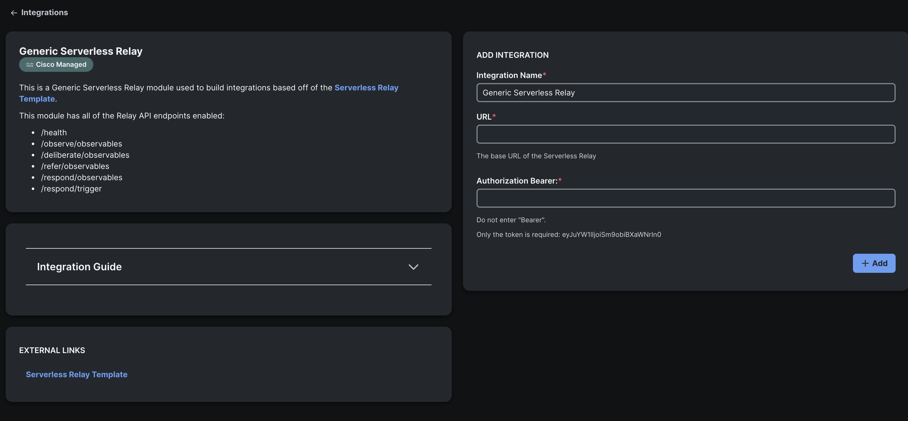

For this guide, we will use _Wazuh_ an Opensource XDR as the our integration. You may use any that want, but to be able to follow along step by step, we recommend using _Wazuh_ as well.

In the _Integration Name_ field, input _Wazuh_.

In the _URL_ field, enter the ngrok _Forwarder_ URL with nothing at the end of it.

In the _Bearer_ field, you may enter whatever you want. We will not be using one at the moment.

Your relay settings should look similar to the below:

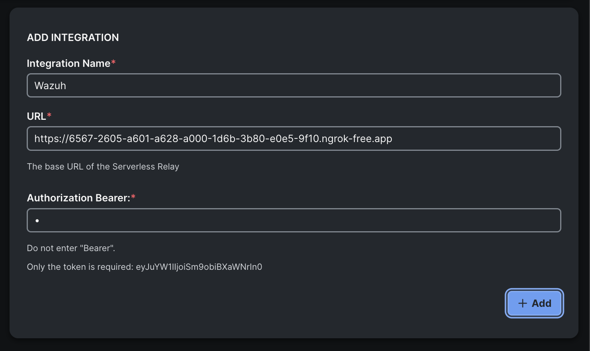

Before we click on _Add_, we need change the health check from a GET to a POST. Go to the `routes -> health` directory. Open the `healthRoute.js` file. It should look like this:

```javascript healthRoute.js
module.exports = (app) => {
  app.get('/health', async (req, res) => {
    res.send({ data: { status: 'ok' } });
  });
};
```

We need to change the GET type to a POST. Replace `get` with `post`. It should now lok like the below:

```javascript healthRoute.js
module.exports = (app) => {
  app.post('/health', async (req, res) => {
    res.send({ data: { status: 'ok' } });
  });
};
```

Save this file and then restart the Node server by using CTRL + C then running it with `node index.js`.

Now that we have done that, we can click on _Add_.

You should get a connected message.

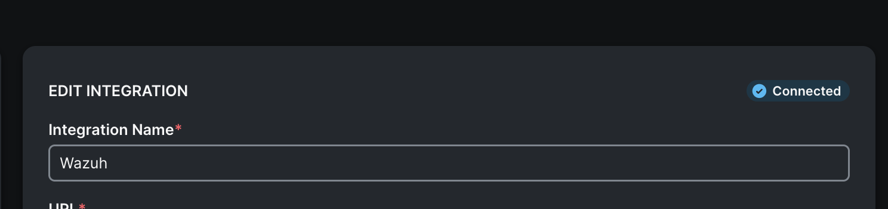

With this, we have finished making sure the module is running and accessible and that XDR can connect to it.

:::note
This is a quick way get an integration connected to Cisco XDR for development. But it will not have everything that can be done with a relay module. As an example, if your product is able to provide value to the XDR Dashboard area, then we will need to create a **module type** that enables the _tile_ functionality.
:::

Next, we will create a **module type**. This is the official way to add an integration to Cisco XDR and it is how your product will be shown within the Cisco XDR Integrations page.
