# Creating a Module Type

To create dashboard tiles, we first need to create a **module type**. A **module type** defines what Cisco XDR is able to use the relay module for. The below are different options that can be selected when creating a **module type**:

- health
- deliberate
- refer
- observe
- respond (via an observable)
- respond (via a trigger)
- tiles

Of the above options, the _health_ options needs to be selected when creating a module type. This is because Cisco XDR will need to check the health of the relay module before it can be used for any other options.

Depending on your integration, you may only want some of these options enabled for your relay module. For our example, we will use all of them, but we will only enable them as we start to build that functionality.

Additionaly, your service's logo, title, URL, and authorization schema will be defined in the **module type**. This is the URL that Cisco XDR will use to communicate with your relay module. The authorization schema is the method that Cisco XDR will use to authenticate with your relay module. The option we support for authentication include:

- authorization header
- basic
- bearer
- configuration-token
- none

Lets create a module using the **Module Maker** we provide.

## Module Maker

If you take a look at this [module maker](https://ciscosecurity.github.io/tr-05-module-maker/) page. You should see something similar to the below image:
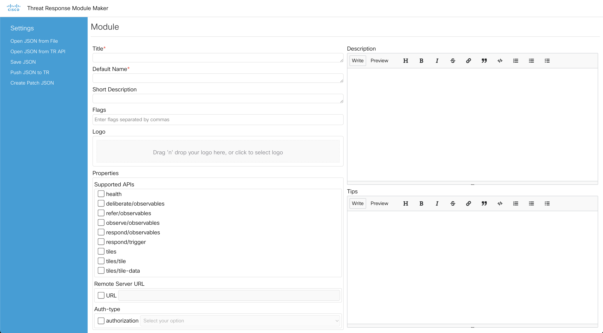

For our example, we are making an integration with Wazuh. So we will fill in the information as below:

- **Title**: Wazuh
- **Default Name**: Wazuh
- **Logo**: upload the wazuh logo or any image you like
- **URL**: the ngrok URL we got from the previous page
- **Authorization**: select the authorization method you want to use. For this example, we will use _basic_ here.

It should start to look like the below image:
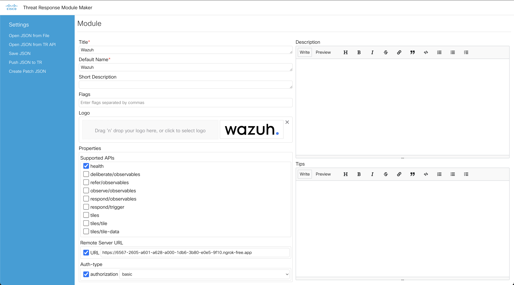

Scroll down some in the area where we were filling in the module information and you should see a **Configuration Spec +Add** option. Click on the add button twice.

Now there should be two blank asking for a key, type, and label.

We will fill each in as follows. The top box will be used as the username box within XDR when someone wants to integrate with Wazuh.

- key = _basic-auth-user_
- type = _string_
- label = _API user_

The second box will be where we put the password the user needs to enter when adding the integration.

- key = _basic-auth-password_
- type = _password_
- label = _Password_

Then check the box **Required** at the bottom of both boxes. It should look similar to what is below:
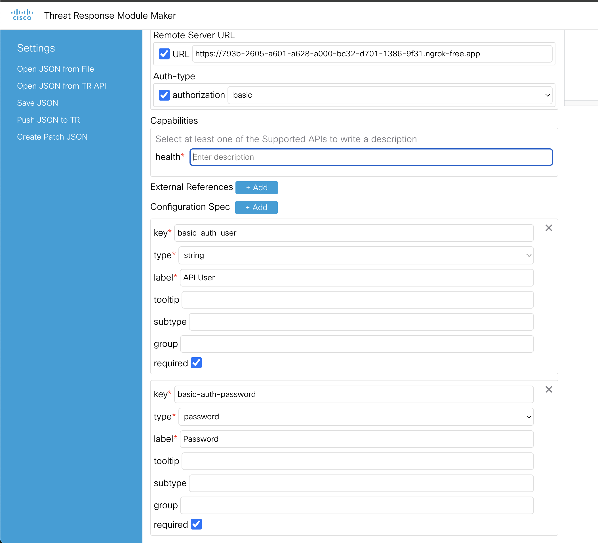

Lastly, add a description to the health capability and then we can save it. I entered _health_ as my description.

On the left side of the page in the blue navigation bar, click on **Save JSON**.
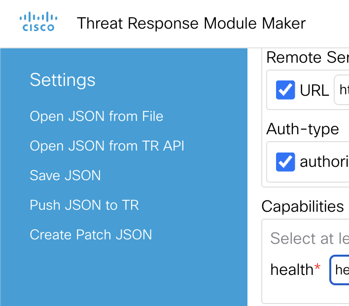

That should have downloaded a _Wazuh_module_type.json_ to your computer.

Next we will upload this to our XDR instance using the IROH Module Type APIs.

## Upload Module Type to Cisco XDR

To upload our module type to Cisco XDR we need to go to the [IROH Module Type API swagger](https://visibility.amp.cisco.com/iroh/iroh-int/index.html).

After the page loads, it should look like the below image:
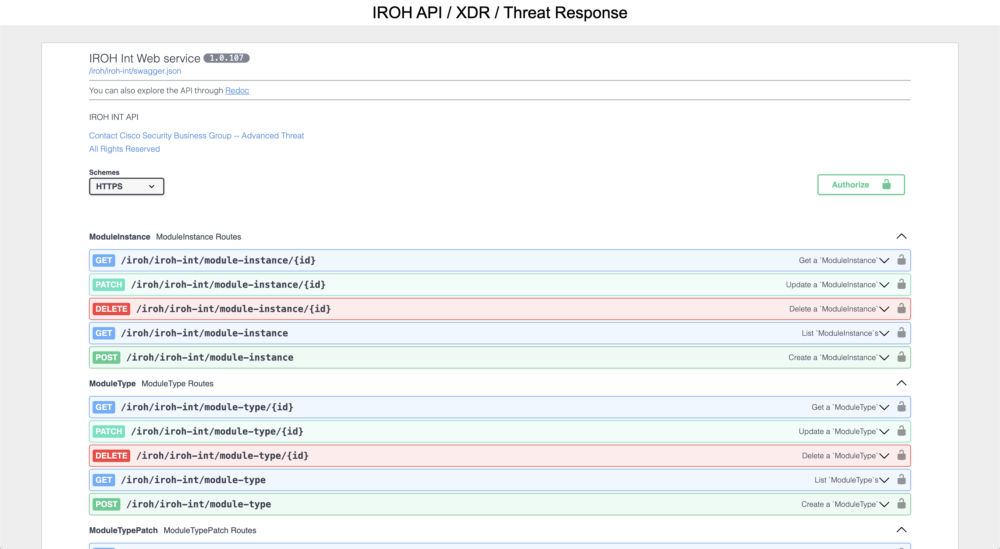

Click the white button with the green outline called **Authorize** on the right side of the screen. It should pop up a screen asking you how to login like what is shown below:
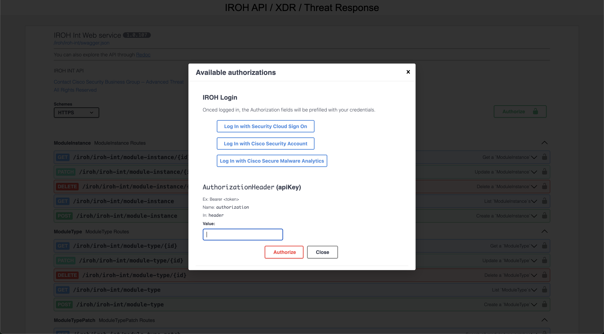

Click on the first option _Log In with Security Cloud Sign On_ and go through the SSO process to sign into your Cisco XDR tenant.

After the login is successful, go down to the **ModuleType** section and expand the **POST** requestion option.
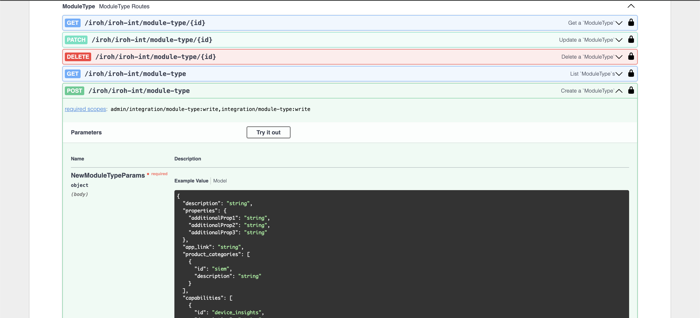

Click on the **Try it out** button and it will open up the editor for us to paste in the JSON we saved from the _Module Maker_.

Copy the JSON code from the file that was downloaded and then _select all_ in the edit box of the swagger docs. Then past the JSON into the box. It should look similar to the below:

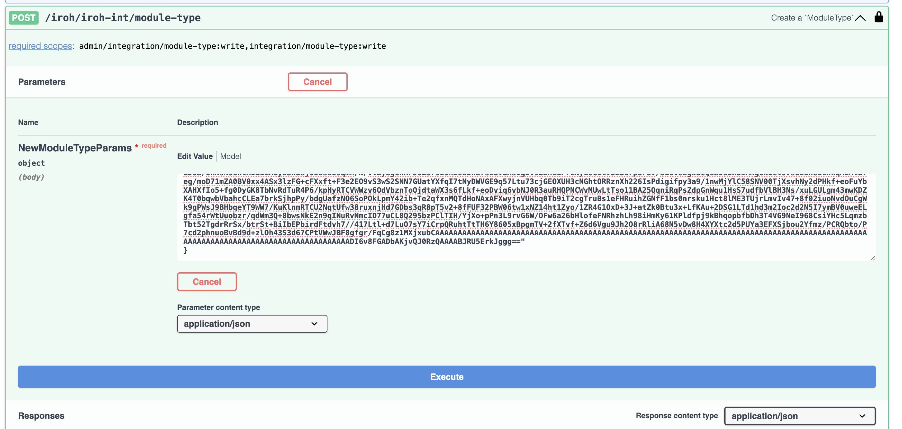

Then click on the big **Execute** button at the bottom.

If you scroll down, you will see the curl version of the request and then farther down you should see a 201 response code and it will be the new module being added to Cisco XDR.

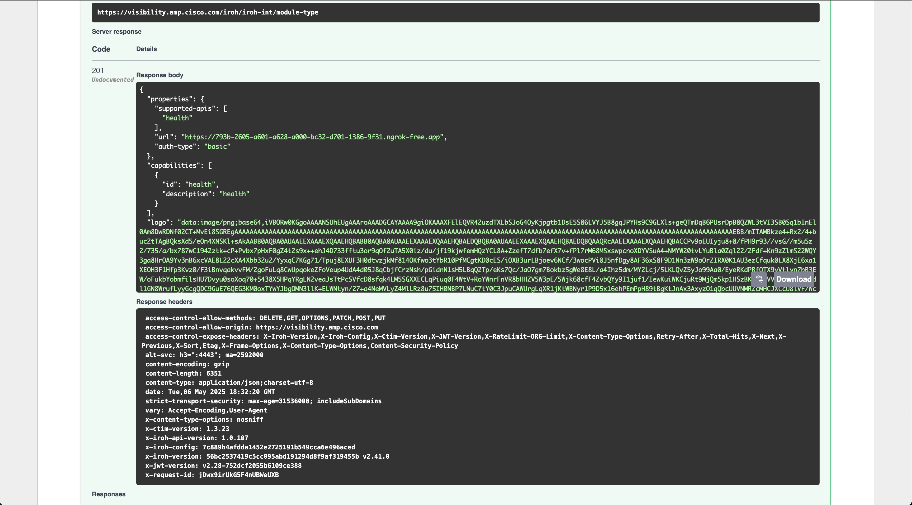

Now lets check Cisco XDR to see if it is there as an option to add.

## Check XDR Module

Log into Cisco XDR and go to the integrations tab like we did when adding the "Generic" integration.

Then look for the new Wazuh integration in the _Third Party_ tab.
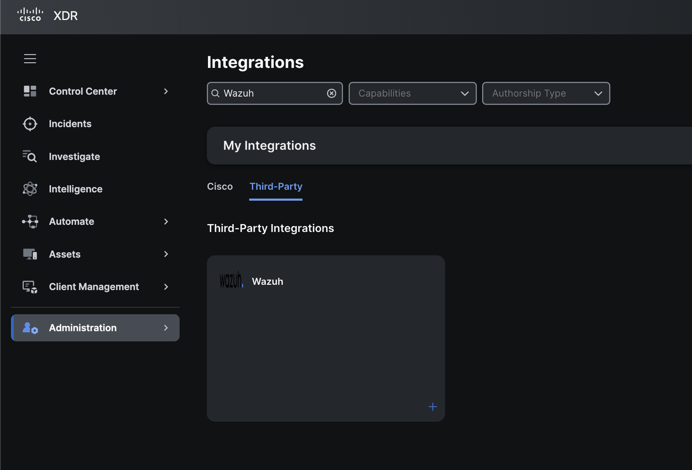

If you click on _+_ sign on the bottom right of that module it will bring you to configuration page of this integration.
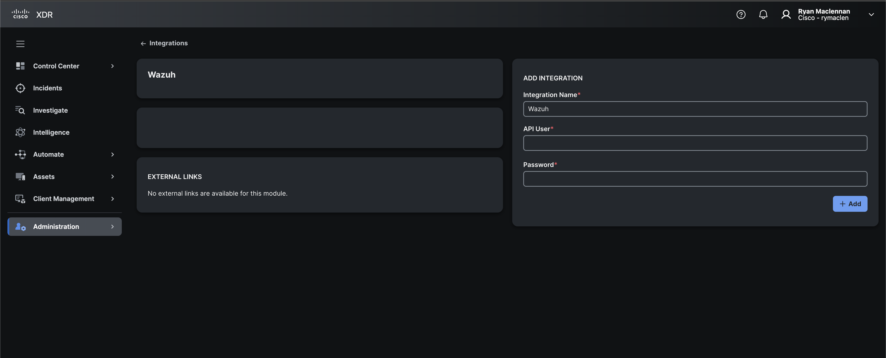

In here, add the Wazuh API user and password, then click on **+ Add**. It should say the integration is connected after a second or two.
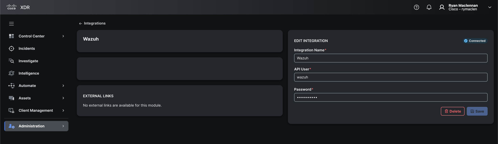

If you want to go right to updating the _module type_ definition for each feature here is a link to where we go over those updates:

- [Dashboard tiles](dashboard-tiles/wazuh-dashboard-tiles#module-type-updates)
- Incidents
- Investigate

Next we will make it so the module can use the basic auth sent to it from Cisco XDR.
