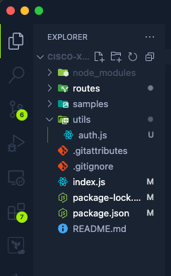

# Using Auth in a Module

The next thing we need to do is allow our module to read the authentication headers sent to it. These credentials will be used to make all API calls the module may need to do.

In this section we will create a helper function to pull the credentials from the header of the file so they can be used elsewhere in the module.

## Create helper utilities

In your IDE, create a new folder at the root level of the project called **utils**. THis will be where we create out helper functions.

In this folder create a new file called **auth.js**



The authentication helpers will be used by each API route we make in the future. So it will be called by each route when it is initially queried and then it will pull out the credentials and get our Wazuh API token.

In the blank _auth.js_ file, paste the following code. This code will be used to parse the basic authentication token and get us the username and password that was sent in it.

```javascript
import axios from 'axios';
import https from 'https';

module.exports = {
  getAuthHeaders: async function (headers) {
    const auth = new Buffer.from(headers.split(' ')[1], 'base64')
      .toString()
      .split(':');
    const user = auth[0];
    const pass = auth[1];
    return { user, pass };
  },
};
```

The above code exports an object of functions. the _module.exports_ is the exporting function that Node uses to export data or functions to be used in other files. The next thing we do is name the entry and then set the function along with what it will do. In this case, we are parsing the auth headers.

Next we need to get the authentication token that Wazuh requires. Wazuh requires us to call their authentication API with a username and password and then it will return a JWT token for us to use for the rest of the API calls. The below is the code needed to make that call.

```javascript
  getToken: async function (user, pass) {
    const instance = axios.create({
      httpsAgent: new https.Agent({ rejectUnauthorized: false }),
    });
    const response = await instance.post(
      'https://ec2-3-134-247-125.us-east-2.compute.amazonaws.com:55000/security/user/authenticate',
      '',
      {
        params: {
          raw: 'true',
        },
        auth: {
          username: user,
          password: pass,
        },
      }
    );

    const token = await response.data;
    return token;
  },
```

The entire file should look similar to the below:

```javascript title="auth.js"
import axios from 'axios';
import https from 'https';

module.exports = {
  getAuthHeaders: async function (headers) {
    const auth = new Buffer.from(headers.split(' ')[1], 'base64')
      .toString()
      .split(':');
    const user = auth[0];
    const pass = auth[1];
    return { user, pass };
  },
  getToken: async function (user, pass) {
    const instance = axios.create({
      httpsAgent: new https.Agent({ rejectUnauthorized: false }),
    });
    const response = await instance.post(
      'https://ec2-3-134-247-125.us-east-2.compute.amazonaws.com:55000/security/user/authenticate',
      '',
      {
        params: {
          raw: 'true',
        },
        auth: {
          username: user,
          password: pass,
        },
      }
    );

    const token = await response.data;
    return token;
  },
};
```

With the authentication helper finished, we can now use it in other parts of our code.

Lets start creating additional functionality in our module starting with Dashboard Tiles
