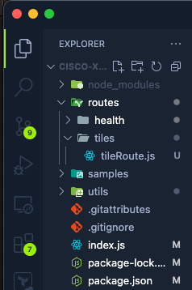
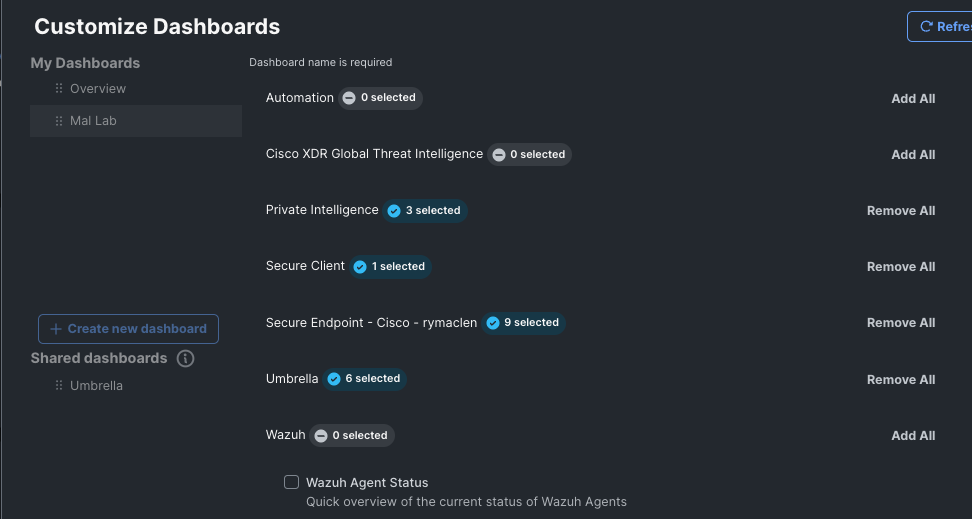
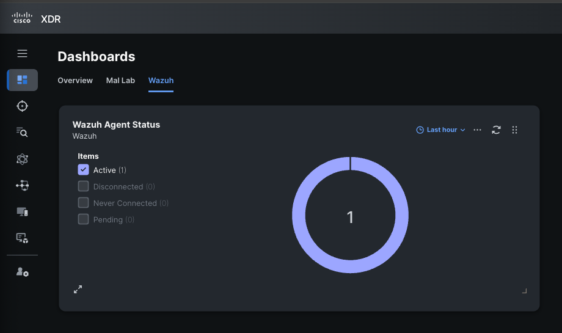

import Tabs from '@theme/Tabs';
import TabItem from '@theme/TabItem';

# Creating Dashboard Tiles (with Wazuh)

## Dashboard Type Examples

:::note
To get more dashboard tile types, try using this [link](https://xdr.us.security.cisco.com/control-center?demo-tiles=1) to get more examples of the dashboards and add them to your XDR instance[](https://xdr.us.security.cisco.com/control-center?demo-tiles=1)
:::

## Module Type updates

### Get a Module ID

Lets get the our module's ID so we can update. Find the **ModuleType** routes and go to the **GET** request route _/iroh/iroh-int/module-type_.


Click on **Try it out** and then **Execute**. This will get all of the modules you have in XDR. In the blob of JSON that is returned search for _Wazuh_ and search for the _id_ field in the entry for Wazuh. Save this ID so we can use it later.

Now that we have our module ID, we can update the module functionality for tiles data.

### Add Dashboard Tile functionality

To add the tiles functionality we need to to use the below JSON to **PATCH** our module.

```json
{
  "properties": {
    "supported-apis": ["health", "tiles", "tiles/tile", "tiles/tile-data"]
  },
  "capabilities": [
    {
      "id": "tiles",
      "description": "Wazuh Tiles"
    },
    {
      "id": "health",
      "description": "health check for Wazuh module"
    }
  ]
}
```

:::danger

You have to append to the capabilities list and to the supported apis list for the functionality you want to add to work. If you only input the tiles endpoint it will update the module to only use the tiles endpoint. Appending the tiles to the health endpoint and then patching will allow the module to use both.

:::warning

It is very important to use double quotes here or the swagger docs will not send the request.

:::

Copy the above snippet and find the **ModuleType** routes for **PATCH** _/iroh/iroh-int/module-type/\{id\}_


Click on **Try it out**, paste the module ID in the **id** field and then paste the JSON above into the **PatchModuleTypeParams** field.

Your update should look similar to the below:


If you look in the response, you should see there is a section for supported APIs and capabilities. Both of these should list the various tile endpoints in them.


Before we continue with the tile development, there are some helper functions we need to create to make our development easier. Most notably, we will need to create helper functions to get various time frames that Cisco XDR Tiles will use to display data and query.

## Create Time Helper functions

In the **utils** folder, create a new file called **time.js**.

In this file, we will export a few functions that will get the current time, 1 hour ago, 24 hours ago, and 1 month ago.

Here is the code needed to do that. Note that these are returned in epoch time for easy conversion and comparisons.

```javascript title="time.js"
module.exports = {
  getNow: function () {
    const date = new Date();
    const epochTimeInSeconds = Math.floor(Date.now() / 1000);
    return epochTimeInSeconds;
  },
  getHourAgo: function (nowTime) {
    return nowTime - 3600;
  },
  getDayAgo: function (nowTime) {
    return nowTime - 86400;
  },
  getMonthAgo: function (nowTime) {
    return nowTime - 2592000;
  },
};
```

Lastly, we need to make a **Tile Type** definition. This definition is used by Cisco XDR to determine what types of Dashboard Tiles are available to display in Cisco XDR.

## Create Tile Types Definition

We will work with one type of chart for this example, but you can use the example data from earlier in this section to make more.

In the **utils** folder, create a new file called **tileTypes.js**.

Within the **tileTypes.js** file, paste in the below code:

```javascript
module.exports = [
  {
    id: 'wazuh_agent_status',
    type: 'donut_graph',
    periods: ['last_hour', 'last_24_hours', 'last_7_days'],
    title: 'Wazuh Agent Status',
    short_description: 'Quick overview of the current status of Wazuh Agents',
    description: '',
    tags: ['wazuh', 'agents'],
  },
];
```

Now let us create our tiles route and get data flowing into Cisco XDR.

## Create Tiles Route

In your IDE, create new folder within the **Routes** folder called **tiles**. Within this **tiles** folder, create a file called **tileRoute.js**.



Add the below code into the **tileRoute.js** file.

```javascript title="tileRoute.js"
const axios = require('axios');
const https = require('https');
const tileTypes = require('../../utils/tileTypes.js');
const timeFunctions = require('../../utils/time.js');
const authFunctions = require('../../utils/auth.js');

const instance = axios.create({
  httpsAgent: new https.Agent({ rejectUnauthorized: false }),
});

module.exports = (app) => {
  app.post('/tiles', async (req, res) => {
    res.send({ data: tileTypes });
  });
};
```

The above code imports the time helpers, auth helpers, and the tileTypes we created earlier. Then we create a new route for _/tiles_, that when it is queried, it will return the tileTypes we made. This is important because this is what allows Cisco XDR to know what the supported tiles are and how they should be displayed.

After this has been done, you can go into Cisco XDR and look to add a new tile in the Dashboard.

Here is what it should look like in Cisco XDR:


Next, lets add another route to the _module.exports_ object:

```javascript title="tileRoute.js"
app.post('/tiles/tile-data', async (req, res) => {
  // highlight-start
  //get auth
  const auth = req.headers.authorization;
  const authentication = await authFunctions.getAuthHeaders(auth);
  const token = await authFunctions.getToken(
    authentication[0],
    authentication[1]
  );
  // highlight-end

  // get timeframe
  // highlight-start
  const postBody = req.body;
  const period = postBody.period;
  const tileId = postBody.tile_id;
  // highlight-end

  const nowTime = timeFunctions.getNow();
  const hourAgo = timeFunctions.getHourAgo(nowTime);
  const nowDate = new Date(nowTime * 1000);
  const hourDate = new Date(hourAgo * 1000);
  let timeFrame;
  let tileData;

  if (period === 'last_hour') {
    timeFrame = timeFunctions.getHourAgo(nowTime);
  }
  if (period === 'last_24_hours') {
    timeFrame = timeFunctions.getDayAgo(nowTime);
  }
  if (period === 'last_week') {
    timeFrame = timeFunctions.getMonthAgo(nowTime);
  }
  if (period === 'last_month') {
    timeFrame = timeFunctions.getMonthAgo(nowTime);
  }
  // switch between tile type to get relevant data requested
  // highlight-start
  if (tileId === 'wazuh_agent_status') {
    const agent_status = await instance.get(
      'https://wazuh_url:55000/overview/agents',
      {
        headers: {
          Authorization: `Bearer ${token}`,
          'Content-Type': 'application/json',
        },
      }
    );
    // highlight-end

    const agent_status_data = await agent_status.data.data.agent_status
      .connection;
    const agent_status_resolved = await agent_status_data;
    res.send({
      data: {
        tile_id: 'wazuh_agent_status',
        cache_scope: 'org',
        labels: [['Active', 'Disconnected', 'Never Connected', 'Pending']],
        valid_time: {
          start_time: hourDate,
          end_time: nowDate,
        },
        observed_time: {
          start_time: hourDate,
          end_time: nowDate,
        },
        observable_type: false,
        data: [
          {
            tooltip: 'Active',
            value: agent_status_data.active,
            key: 0,
          },
          {
            tooltip: 'Disconnected',
            value: agent_status_data.disconnected,
            key: 1,
          },
          {
            tooltip: 'Never Connected',
            value: agent_status_data.never_connected,
            key: 2,
          },
          {
            tooltip: 'Pending',
            value: agent_status_data.pending,
            key: 3,
          },
        ],
      },
    });
  }
  //end agent status tile
});
```

In the above code, the first highlighted section is us getting our authentication token for the following api calls needed. The second highlighted section is important for how we know what tile data we should get and the timeframe for which is has been requested.

Then we have a switch or if statement tree where we perform an action to get the tile data for the requested tile and return it in a format that Cisco XDR expects. Then Cisco XDR will display it like so.



Now lets create some endpoints for the Investigate feature set.
