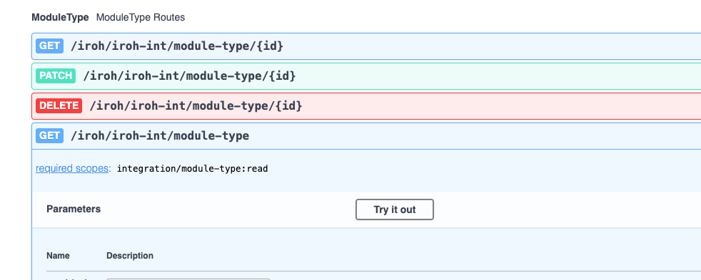
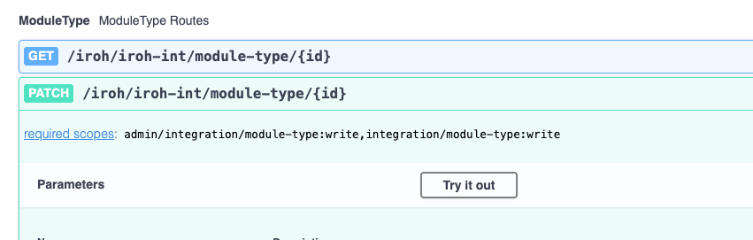
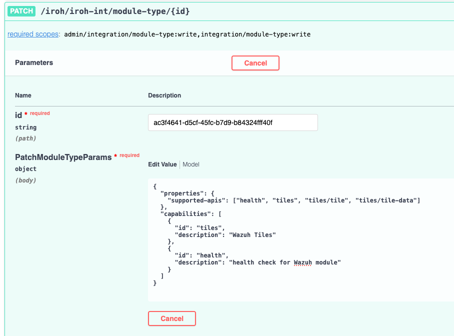
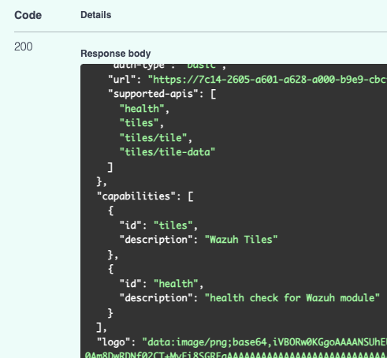

import Tabs from '@theme/Tabs';
import TabItem from '@theme/TabItem';

# Creating Dashboard Tiles (with Wazuh)

## Dashboard Type Examples

<Tabs>
  <TabItem value="Donut" label="Donut" default>
    Incident correlation integrates directly into our Data Analytics Platform
    and can only be developed by Cisco. To make this integration with us, we
    would need your cooperation and readiness to provide technical assistance
    during the development process. However, injecting incidents into XDR does
    not require Cisco to develop an integration.
  </TabItem>
  <TabItem value="Line" label="Line">
    Injected incidents are incidents that are added to the XDR incidents queue
    via API. This bypasses the analytics you get get with the DAP but is a way
    to centralize incidents and create investigations from them.
  </TabItem>
  <TabItem value="Number" label="Number">
    Injected incidents are incidents that are added to the XDR incidents queue
    via API. This bypasses the a
  </TabItem>
</Tabs>

:::note
To get more dashboard tile types, try using this link to get more examples of the dashboards and add them to your XDR instance[](https://xdr.us.security.cisco.com/control-center?demo-tiles=1)
:::

## Module Type updates

### Get a Module ID

Lets get the our module's ID so we can update. Find the **ModuleType** routes and go to the **GET** request route _/iroh/iroh-int/module-type_.


Click on **Try it out** and then **Execute**. THis will get all of the modules you have in XDR. In the blob of JSON that is returned search for _Wazuh_ and search for the _id_ field in the entry for Wazuh. Save this ID so we can use it later.

Now that we have our module ID, we can update the module functionality for tiles data.

### Add Dashboard Tile functionality

To add the tiles functionality we need to to use the below JSON to **PATCH** our module.

```json
{
  "properties": {
    "supported-apis": ["health", "tiles", "tiles/tile", "tiles/tile-data"]
  },
  "capabilities": [
    {
      "id": "tiles",
      "description": "Wazuh Tiles"
    },
    {
      "id": "health",
      "description": "health check for Wazuh module"
    }
  ]
}
```

:::danger

You have to append to the capabilities list and to the supported apis list for the functionality you want to add to work. If you only input the tiles endpoint it will update the module to only use the tiles endpoint. Appending the tiles to the health endpoint and then patching will allow the module to use both.

:::warning

It is very important to use double quotes here or the swagger docs will not send the request.

:::

Copy the above snippet and find the **ModuleType** routes for **PATCH** _/iroh/iroh-int/module-type/\{id\}_



Click on **Try it out**, paste the module ID in the **id** field and then paste the JSON above into the **PatchModuleTypeParams** field.

Your update should look similar to the below:



If you look in the response, you should see there is a section for supported APIs and capabilities. Both of these should list the various tile endpoints in them.


