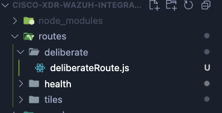
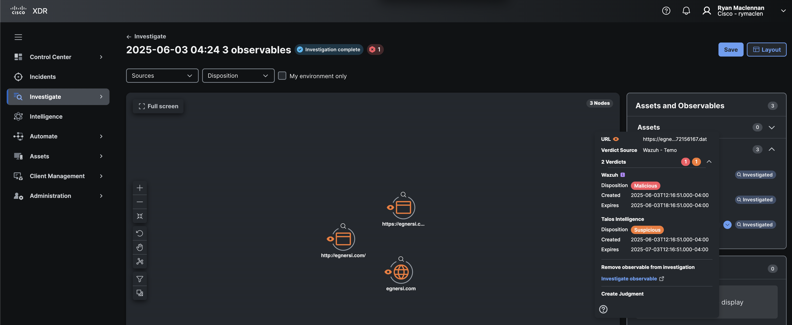

# Deliberation Development

To make a Deliberation integration, you can either continue to use the **Generic Serverless Relay** or update your Module Type to support the Deliberate endpoint.

## Update Module Type JSON

Go to the Module Maker and click on the **Open JSON from File** option on the top left of the page. Select the JSON file for the Wazuh module and open it.

Once it is opened, it should look similar to the below:


Check the three tiles options so we make sure those stay there from the previous section and give them a description.

Now check the _deliberate/observables_ option and give it a description.


Now save the JSON and patch our module using the IROH Swagger docs.

You should get a response with the updated API endpoints and Deliberate should be listed in it.


## Create Deliberate API Endpoint

In your IDE, create a new folder in the **routes** folder called **deliberate**. Then create a new file called **deliberateRoute.js**



To make sure our API endpoint works, we first need to make a few functions that will get our data and then return it in a format that Cisco XDR expects. We are going to use URLHaus for this functionality since Wazuh does not provide verdicts on wether something is malicious, suspicious, etc.

### Import Libraries

First lets import two libraries: axios and the custom _timeFunctions_ we created earlier in this guide.

```javascript showLineNumbers title="deliberateRoute.js"
const axios = require('axios');
const timeFunctions = require('../../utils/time.js');
```

### Create Call to URLHaus API

In the highlighted section, we added an asynchronous function that will reach out to the URLHaus API for any URL we give it.

```javascript showLineNumbers title="deliberateRoute.js"
const axios = require('axios');
const timeFunctions = require('../../utils/time.js');
// highlight-start
const getUrlState = async (url) => {
  const params = new URLSearchParams();
  params.append('url', url);
  const response = await axios.post(
    'https://urlhaus-api.abuse.ch/v1/url/',
    params
  );
  return response.data;
};
// highlight-end
```

### Create a Loop and Return Verdicts

When Cisco XDR queries the deliberate endpoint, it will send an array of observables it wants the integration to check.

Here is an example of what could be sent:

```json
[
  {
    "type": "domain",
    "value": "ilo.brenz.pl"
  },
  {
    "type": "url",
    "value": "http://ilo.brenz.pl/file.dat"
  },
  {
    "type": "email",
    "value": "no-reply@internetbadguys.com"
  },
  {
    "type": "sha256",
    "value": "8fda14f91e27afec5c1b1f71d708775c9b6e2af31e8331bbf26751bc0583dc7e"
  }
]
```

In this section we will only work with URLs.

If your product supports any other observables beside URLs, you can make your integration check for those and do the related tasks needed to get data for them.

In the highlighted section below we are expecting to receive an array and then loop over that array. The first thing we do is make the object that we will add our verdicts to. We are calling this _returnData_.

Then we loop through the array provided to the function and then check if it is a URL type. If it is, we then call the _getUrlState_ function with the observable value.

:::info

You do **NOT** need to return a value for everything sent to the relay module. If your relay will only process sha256s, then you can ignore all other types of observables and only return data on the sha256s.

:::

If we receive a verdict from the URLHaus API, we add the verdict info to the _returnData_ variable.

```javascript showLineNumbers title="deliberateRoute.js"
const axios = require('axios');
const timeFunctions = require('../../utils/time.js');

const getUrlState = async (url) => {
  const params = new URLSearchParams();
  params.append('url', url);
  const response = await axios.post(
    'https://urlhaus-api.abuse.ch/v1/url/',
    params
  );
  return response.data;
};

// highlight-start
const urlLoop = async (observableArray) => {
  let returnData = { verdicts: { count: 0, docs: [] } };
  for (const observable of observableArray) {
    if (observable.type === 'url') {
      console.log(`Processing URL: ${observable.value}`);
      const urlState = await getUrlState(observable.value);
      const url_status = await urlState.query_status;
      if (url_status === 'no_results') {
        console.log(`No results for ${observable.value}`);
      }
      if (url_status === 'ok') {
        returnData['verdicts']['count'] += 1;
        await returnData['verdicts']['docs'].push({
          type: 'verdict',
          disposition: 2,
          observable: {
            value: observable.value,
            type: 'url',
          },
          disposition_name: 'Malicious',
          valid_time: {
            start_time: new Date(timeFunctions.getNow() * 1000).toISOString(),
            end_time: new Date(
              (timeFunctions.getNow() + 21600) * 1000
            ).toISOString(), // 6 hour validity
          },
        });
        console.log(returnData);
      }
    }
  }

  return returnData;
};
// highlight-end
```

Lets break down the above code a bit more. When you return data to Cisco XDR for the deliberate endpoint. You need to provide it in the below format:

```javascript
"data": {
        "verdicts": {
          "count": 1,
          "docs": [
            {
              "valid_time": {
                "start_time": "2025-06-03T15:03:54.000Z",
                "end_time": "2025-06-03T21:03:54.000Z"
              },
              "observable": {
                "value": "https://globalpanelinc.com/wnx/fGb",
                "type": "url"
              },
              "type": "verdict",
              "disposition": 2,
              "disposition_name": "Malicious"
            }
          ]
        }
      }
```

In our function we have `let returnData = { verdicts: { count: 0, docs: [] } }`

The only things we need to update in this object are the _count_ and the _docs_ array. The _count_ is the number of verdicts that are being returned.

#### Docs Value

The docs value is what contains all the verdicts being returned. Each verdict needs to be an object itself appended to the _docs_ array.

The first value you see here is the _valid_time_, it needs a _start_time_ and an _end_time_. These values determine how long Cisco XDR will cache a verdict from your product. We use a six hour timeframe for it being valid. But if your product updates these verdicts frequently then having it lower could be a better idea.

#### Observable Value

The _observable_ field contains the same info that was sent to the relay module. Add the _type_ and the _value_ that was provided in this field.

#### Type and Disposition values

The _type_ should always be _verdict_ from this API endpoint. But there are others we will go over in another section.

The _disposition_ value is the a numeric identifier of the type of verdict being returned. These can be 1,2,3,4,5.

The _disposition_name_ can be 1 of 5 values: Clean, Malicious, Suspicious, COmmon, and Unknown.

The _disposition_ and _dispostion_name_ map to each other like so:

`{1 "Clean", 2 "Malicious", 3 "Suspicious", 4 "Common", 5 "Unknown"}`

Those are all the values needed to be added to a verdict.

### Deliberate API Endpoint

The last bit of code we need to add is the actual API Endpoint route.

```javascript
module.exports = (app) => {
  app.post('/deliberate/observables', async (req, res) => {
    const observables = req.body;
    const returnData = await urlLoop(observables);
    res.send({ data: returnData });
  });
};
```

We will add this bit to the end of the file and it should look like the below:

```javascript showLineNumbers title="deliberateRoute.js"
const axios = require('axios');
const timeFunctions = require('../../utils/time.js');

const getUrlState = async (url) => {
  const params = new URLSearchParams();
  params.append('url', url);
  const response = await axios.post(
    'https://urlhaus-api.abuse.ch/v1/url/',
    params
  );
  return response.data;
};

const urlLoop = async (observableArray) => {
  let returnData = { verdicts: { count: 0, docs: [] } };
  for (const observable of observableArray) {
    if (observable.type === 'url') {
      console.log(`Processing URL: ${observable.value}`);
      const urlState = await getUrlState(observable.value);
      const url_status = await urlState.query_status;
      if (url_status === 'no_results') {
        console.log(`No results for ${observable.value}`);
      }
      if (url_status === 'ok') {
        returnData['verdicts']['count'] += 1;
        await returnData['verdicts']['docs'].push({
          type: 'verdict',
          disposition: 2,
          observable: {
            value: observable.value,
            type: 'url',
          },
          disposition_name: 'Malicious',
          valid_time: {
            start_time: new Date(timeFunctions.getNow() * 1000).toISOString(),
            end_time: new Date(
              (timeFunctions.getNow() + 21600) * 1000
            ).toISOString(), // 6 hour validity
          },
        });
        console.log(returnData);
      }
    }
  }

  return returnData;
};

// highlight-start
module.exports = (app) => {
  app.post('/deliberate/observables', async (req, res) => {
    const observables = req.body;
    const returnData = await urlLoop(observables);
    res.send({ data: returnData });
  });
};
// highlight-end
```

Once this is done, we can import this into our _index.js_ file.

### Update Index file

```javascript showLineNumbers title="index.js"
const express = require('express');
const axios = require('axios');
const bodyParser = require('body-parser');
const port = 6000;
const WAZUH_API =
  'https://ec2-3-134-247-125.us-east-2.compute.amazonaws.com:55000';

const app = express();
app.use(bodyParser.json());

require('./routes/health/healthRoute.js')(app);
require('./routes/tiles/tileRoute.js')(app);
// highlight-next-line
require('./routes/deliberate/deliberateRoute.js')(app);

app.listen(port, () => {
  console.log(`Example app listening on port ${port}`);
});
```

Now lets test the integration.

### Test the Integration

Go to the **Investigate** page in Cisco XDR and past the below URL into the text box.
`https://egnersi.com/8papP/0.6922216472156167.dat`


Click on the blue **Investigate** button and it will go to a new page and start querying your relay module.

Let the investigation finish and then lok for the URL we submitted int he right pane called **Assets and Observables**. Click on the down arrow circle and expand the _2 Verdicts_ section at the top. We should see the _Wazuh_ verdict here (but its actually from URLHaus).



This concludes the section on creating a \_deliberation\* integration. Next we will create a Referral integration.
