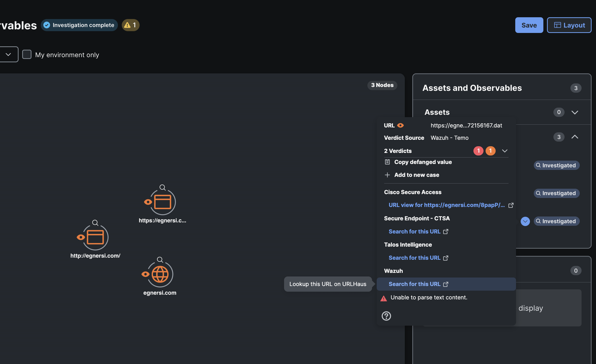

# Referral Development

Referrals in Cisco XDR is an option to link out to your product for an observable.

Similar to the _deliberate_ endpoint, we will receive an array of observables with a type and a value.

We will respond only to the values that we are able to provide a link for. In the case of URLHaus, we would only respond to URL types. When it comes to Wazuh, we can respond with hashes, URLs, emails and many others.

## Referrals for URLHaus

To continue building on the verdicts being provided by URLHaus, we will add a referral option that we will be replace with Wazuh later.

We just need to change our For Loop logic to make the refer work. Copy the urlLoop function and paste it. Rename it _urlLoopRefer_.

Then we need to change the data that is returned and what values we pull from the URLHaus response.

The highlighted lines below are what are different now:

```javascript
// highlight-next-line
const urlLoopRefer = async (observableArray) => {
  // highlight-next-line
  let returnData = [];
  for (const observable of observableArray) {
    if (observable.type === 'url') {
      console.log(`Processing URL: ${observable.value}`);
      const urlState = await getUrlState(observable.value);
      const url_status = await urlState.query_status;
      if (url_status === 'no_results') {
        console.log(`No results for ${observable.value}`);
      }
      if (url_status === 'ok') {
        // highlight-start
        await returnData.push({
          id: `ref-urlhaus-search-url-${observable.value}`,
          title: 'Search for this URL',
          description: 'Lookup this URL on URLHaus',
          url: urlState.urlhaus_reference,
        });
        // highlight-end
        console.log(returnData);
      }
    }
  }

  return returnData;
};
```

In the above code, we can see that we now push an object with these field `id, title, description, url`

These are all the required fields needed to make refer work.

The _id_ field needs to be a unique id. In this guide we have called it what tool is being used and then add the observable value to it. That should be unique enough for most needs.

The _title_ field is used for what the link will say in Cisco XDR.

The _description_ field is the text used in the popup when hovering over the link.

The _url_ is a customer URL used to link back to your product. You can see we pull our the urlhaus_reference field here. This is a link to the URLHaus page for the malicious url provided.

Now we need to add the refer endpoint to the _module.exports_ section.

```javascript
app.post('/refer/observables', async (req, res) => {
  const observables = req.body;
  const returnData = await urlLoopRefer(observables);
  res.send({ data: returnData });
});
```

The entire file should look like the below:

```javascript showLineNumbers title="deliberateRoute.js"
const axios = require('axios');
const timeFunctions = require('../../utils/time.js');

const getUrlState = async (url) => {
  const params = new URLSearchParams();
  params.append('url', url);
  const response = await axios.post(
    'https://urlhaus-api.abuse.ch/v1/url/',
    params
  );
  return response.data;
};

const urlLoop = async (observableArray) => {
  let returnData = { verdicts: { count: 0, docs: [] } };
  for (const observable of observableArray) {
    if (observable.type === 'url') {
      console.log(`Processing URL: ${observable.value}`);
      const urlState = await getUrlState(observable.value);
      const url_status = await urlState.query_status;
      if (url_status === 'no_results') {
        console.log(`No results for ${observable.value}`);
      }
      if (url_status === 'ok') {
        returnData['verdicts']['count'] += 1;
        await returnData['verdicts']['docs'].push({
          type: 'verdict',
          disposition: 2,
          observable: {
            value: observable.value,
            type: 'url',
          },
          disposition_name: 'Malicious',
          valid_time: {
            start_time: new Date(timeFunctions.getNow() * 1000).toISOString(),
            end_time: new Date(
              (timeFunctions.getNow() + 21600) * 1000
            ).toISOString(), // 6 hour validity
          },
        });
        console.log(returnData);
      }
    }
  }

  return returnData;
};

const urlLoopRefer = async (observableArray) => {
  let returnData = [];
  for (const observable of observableArray) {
    if (observable.type === 'url') {
      console.log(`Processing URL: ${observable.value}`);
      const urlState = await getUrlState(observable.value);
      const url_status = await urlState.query_status;
      if (url_status === 'no_results') {
        console.log(`No results for ${observable.value}`);
      }
      if (url_status === 'ok') {
        await returnData.push({
          id: `ref-urlhaus-search-url-${observable.value}`,
          title: 'Search for this URL',
          description: 'Lookup this URL on URLHaus',
          url: urlState.urlhaus_reference,
        });
        console.log(returnData);
      }
    }
  }

  return returnData;
};

module.exports = (app) => {
  app.post('/deliberate/observables', async (req, res) => {
    const observables = req.body;
    const returnData = await urlLoop(observables);
    res.send({ data: returnData });
  });

  app.post('/refer/observables', async (req, res) => {
    const observables = req.body;
    const returnData = await urlLoopRefer(observables);
    res.send({ data: returnData });
  });
};
```

Now lets go into the Investigation from earlier and click on the drowdown next to the URL. A new call should be made out to our relay module and then we should see a link that links out to URLHaus.



Clicking on that link should bring us to URLHaus:


## Referrals for Wazuh
